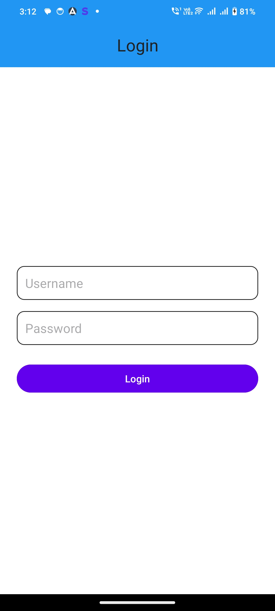
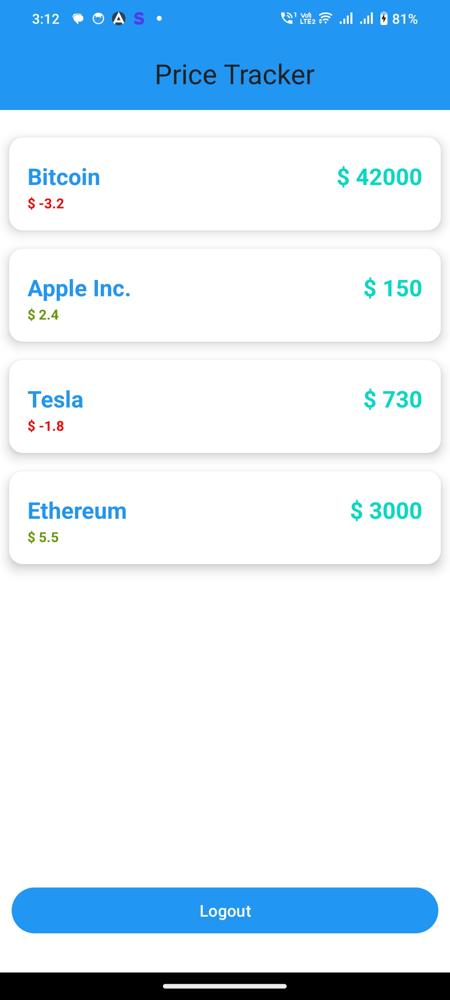

# 📱 Price Tracker App

This Android app demonstrates API integration by allowing users to log
in and view a list of Real time Price changes. The app handles authentication and
token-based API calls securely using Retrofit.
---

## ✨ Features Implemented

- Login with username and password
    - Authenticates users via `POST https://api.prepstripe.com/login`
- 📊 **Live Price Fetching**
    - Retrieves prices from `GET https://api.prepstripe.com/prices`
    - Displays data in a responsive `RecyclerView`
- 🧬 **Biometric Authentication**
    - Provides secure access on subsequent app launches
- Error handling and user-friendly messages
- - 🔁 **Real-Time Price Updates**
    - Updates prices automatically in the background
- 🔓 **Logout Functionality**
    - Clears token and returns user to the login screen


## 🚧 Features In Progress

- 🔔 **Firebase Cloud Messaging (FCM)**
    - Will send price change notifications to users
- 📈 **MPAndroidChart Integration**
    - Will visualize price trends in graph form

---


## 📸 Screenshots



## 🛠️ Tech Stack

- Java 
- Android SDK
- REST APIs (via Retrofit)
- BiometricPrompt API
- Firebase Cloud Messaging (planned)
- MPAndroidChart (planned)

---

## 🚀 How to Build the APK

### Installation and Build APK Instructions
1. Clone this repo:
   ```bash
   git clone https://github.com/ArunkumarThatikanti/prices-tracker.git

2. Open the Project in Android Studio
- Launch Android Studio.
- Choose "File > Open > Navigate to the folder you just cloned" or you can click on "file > new > project from version control > paste clone url".
- Go to Build > Build Bundle(s) / APK(s) > Build APK(s).
  After the build completes, click "locate" to find the APK in:
  app/build/outputs/apk/debug/app-debug.apk
- you can add this apk to mobile device and install.

## 🚀 Bonus Feature
- Added dask mode (UI colors will change according to system theme).